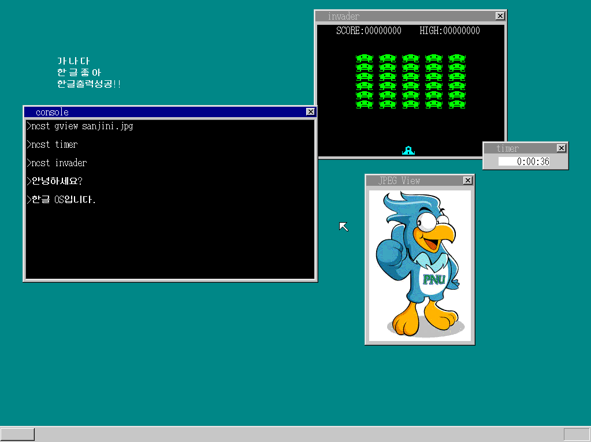

## OS 구조와 원리: OS 개발 30일 프로젝트



### 프로젝트 개요

> 본 프로젝트는 카와이 히데미(川合秀実)의 저서 **「OS 구조와 원리」** 를 기반으로 시스템 프로그래밍 및 운영체제 내부 동작 원리에 대한 이해를 목표로 진행한 OS 개발 실습 프로젝트입니다.
>
> 부산대학교 정보컴퓨터공학부 **프로그래밍언어 연구실** 우균 교수님과 김영훈 연구원님의 지도 하에 진행되었으며, Bare-metal 환경에서 실제로 부팅 가능한 간단한 운영체제를 직접 구현하였습니다.

### 기술적 도전 : 한글 입출력 시스템

기존 교재에서는 자세히 다루지 않는 한글 입출력 시스템(오토마타)을 독자적으로 설계 및 구현하여
영문뿐만 아니라 한글 조합 및 출력이 가능합니다.

> **한글 오토마타 구현**


기존의 영문 전용 OS를 확장하여, 한국어 특유의 조합 논리를 처리하는 **유한 상태 머신(Finite State Machine)** 을 구현했습니다.

- 조합형 렌더링: 폰트 데이터를 초/중/종성으로 분리하여 실시간 조합 출력 (둥근모꼴(H04) 사용)
- 도깨비불 현상(종성우선 현상) 해결: 초성+중성+초성 상태에서 모음 입력 시 종성을 차기 음절의 초성으로 분리하는 로직 구현
- 한/영 전환: 한글 언어모드 사용 중 필요할 경우 영어 타이핑이 가능하도록 언어전환 구현

### 구현 기능

- **Bootloader (IPL)** 
    - FAT12 포맷의 플로피 디스크 이미지에서 커널을 메모리로 로드
    - BIOS 인터럽트를 이용한 디스크 섹터 읽기 구현
- **32-bit Mode Switching**
    - 16-bit Real Mode에서 32-bit Protected Mode로 전환
    - GDT(Global Descriptor Table) 구성 및 세그먼트 레지스터 설정
- **Interrupt Handling**
    - IDT(Interrupt Descriptor Table) 구성
- **Memory Management**
    - 32 비트 FIFO 버퍼를 통해 메모리 관리 및 태스크 간 통신 구현
- **Mouse/Keyboard Control**
    - PS/2 사양의 마우스와 키보드 인터럽트 처리 구현
- **Multitasking & CPU Scheduling**
    - TSS를 사용한 멀티태스킹 구현
    - MLQ 스케줄링 구현
- **API**
    - 시스템 콜 구현
- **LDT**
    - LDT(Local Descriptor Table)를 통한 메모리 보호 구현
- **FILE API**
    - 파일 열기/닫기/찾기/읽기 API 구현
- **Korean I/O**
    - 한글 오토마타를 통한 입출력 구현

### 기술 스택

> **언어**

- C Language
    - OS 커널 로직 구현
    - 표준 라이브러리 없는 환경에서 저수준 시스템 프로그래밍

- Assembly (NASK)
    - 부트로더 구현
    - CPU 모드 전환, 레지스터 직접 제어

> **빌드 및 개발 환경**

- GCC
- WSL2 (Ubuntu)
- Git

> **하드웨어 추상화 및 에뮬레이션**

- Qemu: qemu-system-i386
- VMware

### 메모리 레이아웃

```
	+-------------------+
    |     VRAM Area     |
    |       (VBE)       |
    +-------------------+
            ...     
    +-------------------+
    |     Available     |
    |     Memory        |
    +-------------------+ <--- 0x00400000
    |      Memory       |
    |      Manager      |
    +-------------------+ <--- 0x003c0000
    |     Stack/Data    |
    +-------------------+
    |        BOOT       |
    |        PACK       |
    |      (kernel)     |
    +-------------------+ <--- 0x00280000
    |        GDT        |
    |        Area       |
    +-------------------+ <--- 0x00270000
    |        IDT        |
    |        Area       |
    +-------------------+ <--- 0x0026f800
    |       Empty       |	
    +-------------------+
    |       Disk        |
    |       Image       |
    +-------------------+ <--- 0x00100000
    |     BIOS ROM      |
    +-------------------+ <--- 0x000c0000
    |     VRAM (VGA)    |
    +-------------------+ <--- 0x000a0000
    |   BIOS/Reserved   |
    +-------------------+ <--- 0x0009f000
    |      Available    |
    |      Memory       |
    +-------------------+ <--- 0x00001000
    |       BOOT        |
    |       INFO        |
    +-------------------+ <--- 0x00000ff0
    | Korean Font Addr  |
    +-------------------+ <--- 0x00000fe8
    |    SHTCTL Addr    |
    +-------------------+ <--- 0x00000fe4
    |       Stack       |
    +-------------------+ <--- 0x00000500
    |	Bios Data Area	|
    |	    (BDA)       |
    +-------------------+ <--- 0x00000400
    |        IVT        |
    +-------------------+ <--- 0x00000000
```

### 프로젝트 구조

```
.
├── 📄Makefile
├── 📄README.md
├── 📂app
│   ├── 📁api
│   ├── 📁bball
│   ├── 📁beepdown
│   ├── 📁calc
│   ├── 📁color
│   ├── 📄common.mk
│   ├── 📁gview
│   ├── 📁include
│   ├── 📁invader
│   ├── 📁korHI
│   ├── 📁mmlplay
│   ├── 📁timer
│   ├── 📁tview
│   ├── 📁type
│   └── 📁walk
├── 📂src
│   ├── 📂boot
│   │   ├── 📄asmhead.nas
│   │   └── 📄ipl.nas
│   ├── 📂drivers
│   │   ├── 📄graphic.c
│   │   ├── 📄int.c
│   │   ├── 📄keyboard.c
│   │   ├── 📄mouse.c
│   │   └── 📄timer.c
│   ├── 📂graphics
│   │   └── 📂font
│   │       ├── 📄E2.FNT
│   │       └── 📄H04.FNT
│   ├── 📂include
│   │   ├── 📄bootpack.h
│   │   ├── 📄hangul.h
│   │   └── 📄utf8.h
│   ├── 📂kernel
│   │   ├── 📄bootpack.c
│   │   ├── 📄console.c
│   │   ├── 📄dsctbl.c
│   │   ├── 📄file.c
│   │   ├── 📄memory.c
│   │   ├── 📄mtask.c
│   │   ├── 📄naskfunc.nas
│   │   ├── 📄sheet.c
│   │   └── 📄window.c
│   ├── 📂lib
│   │   ├── 📄fifo.c
│   │   ├── 📄hangul.c
│   │   ├── 📄tek.c
│   │   └── 📄utf8.c
│   └── 📁mowkow
├── 📂testfiles
│   ├── 📄sanjini.jpg
│   └── 📄날개.txt
└── 📁tools
```
